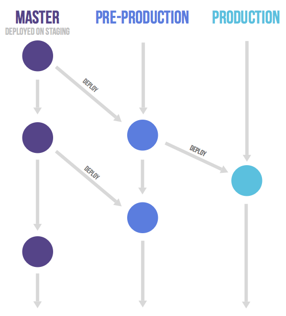

# Git Flow
## 中心思想
  
**主要分支(长期分支)**  
- master: 永远处在即将发布(production-ready)状态
- develop: 最新的开发状态

**辅助分支(短期分支)**    
- feature: 开发新功能的分支, 基于 develop, 完成后 merge 回 develop
- release: 准备要发布版本的分支, 用来修复 bug. 基于 develop, 完成后 merge 回 develop 和 master
- hotfix: 修复 master 上的问题, 等不及 release 版本就必须马上上线. 基于 master, 完成后 merge 回 master 和 develop

**案例**  
https://gitlab.com/gitlab-org/gitter/webapp/network/master

**特点**  
基于版本的，由master实时记录发布的版本，目标是每个一段时间就产出一个新的版本。

**优点：**  
- 清晰可控
- 代码隔离性强，每个版本发布到release分支之后就会和develop分离开来，之后提交到develop中的代码都不会影响到本次发布的代码
- 无需保障develop中的代码是实时可以发布的，release之后的代码不会受develop中的代码影响。

**缺点：**  
- 相对比较复杂
- 新手需要比较清楚地了解整个开发的流程才可进行开发
- 容易不小心pull错代码（比如把master合并到feature分支）
- 容易不小心push错代码（比如把feature合并到master上）
- 容易忘记将release的分支或者hotfix的分支合并到develop中
- 需要在不同的分支中频繁切换

**[参考]**  

1. [介绍一个成功的 Git 分支模型](https://www.oschina.net/translate/a-successful-git-branching-model)
2. [A successful Git branching model](https://nvie.com/posts/a-successful-git-branching-model/)

## 相关使用指令
由于Gitflow分支比较多，所以可以使用特殊的工具[gitflow](https://github.com/nvie/gitflow)来简化操作  
git flow是git的辅助工具，实质上是一些分支-合并的脚本集合，使用git flow可以更轻松的完成对各种特性分支的操作。
```
安装：  
apt-get install git-flow  

将git库转换为git-flow库：  
git flow init  
实质上这一步只是为git flow中的几个特性分支命名。  
  
开始一个新功能：  
git flow feature start xxxx  
  
提交这个功能到远程库：  
git flow feature publish xxxx  
  
完成功能，合并到develop：  
git flow feature finish xxxx  
  
记得删除远程仓库里的分支：  
git push origin :xxxx  
  
release,hotfix与之类似，唯一的一点区别：hotfix目前没有publish功能，所以提交远程仓库的这一步要改成：  
git push origin hotfix/xxxx:hotfix/xxxx  
```

**其他文章及使用gitflow工具**  
1. [Gitflow Workflow](https://www.atlassian.com/git/tutorials/comparing-workflows/gitflow-workflow)  
2. [GitHub Flow & Git Flow 基于Git 的两种协作开发模式](http://www.cnblogs.com/sloong/p/5868292.html)  
3. [Git Flow](https://zhangmengpl.gitbooks.io/gitlab-guide/content/whatisgitflow.html)
## 注意事项
使用分支不推荐的是让新功能代码在分支上长时间堆积，分支应当是生存周期短的
master分支的合并职责
关于版本号以及hotfix之后的版本号
tag的规则
如何避免新手提交错分支

## 其他参考

1. [Git 工作流程](http://www.ruanyifeng.com/blog/2015/12/git-workflow.html)  
2. [Git Branch实操练习](https://learngitbranching.js.org/) 
3. [Gitflow 有害论](http://insights.thoughtworkers.org/gitflow-consider-harmful/)  
4. [runk-Based Development ](https://paulhammant.com/2013/04/05/what-is-trunk-based-development/)  
5. [Feature Flag 功能发布控制](http://blog.jobbole.com/73930/)  
6. [FeatureBranch](https://martinfowler.com/bliki/FeatureBranch.html)  
7. [Git工作流指南](https://segmentfault.com/a/1190000008880416?_ea=1929609)  
8. [git-workflow-tutorial.md](https://github.com/xirong/my-git/blob/master/git-workflow-tutorial.md)  
9. [Git 在团队中的最佳实践--如何正确使用Git Flow](http://www.cnblogs.com/cnblogsfans/p/5075073.html)  
10. [使用git,git-flow和gitlab工作](http://blog.2baxb.me/archives/736)  

# Github Flow
## 中心思想
**There's only one rule: anything in the master branch is always deployable.**  
  
**[参考]**  
[Github flow](https://guides.github.com/introduction/flow/)  
[深入理解 GitHub Flow](https://blog.csdn.net/qq_35246620/article/details/65636022)  
**特点**  
- 简单，对于持续发布的产品是最合适的流程

**优点**  
- Github flow 的最大优点就是简单，相对与gitflow，一般的开发者只需要将自己的合并到master即可，无需了解过多的流程。
- 对于"持续发布"的产品，可以说是最合适的流程。

**缺点**    
- 需要有严格的PR过程，以确保合并到master上的代码的质量
- 代码合并进入master分支，并不代表它就能立刻发布
- 为了加快开发，使得任何人都可以提交代码到master分支，无法保障master上的节点都是可以发布的
- 开发中的代码，需要发布的代码，

## 其他参考  

1. [GitHub Flow 及 Git Flow 流程使用時機](https://blog.wu-boy.com/2017/12/github-flow-vs-git-flow/)  
2. [Github Flow - the best way to use git and github](https://githubflow.github.io/)  
3. [Git 版本控制 branch model 分支模組基本介紹](https://blog.wu-boy.com/2011/03/git-%E7%89%88%E6%9C%AC%E6%8E%A7%E5%88%B6-branch-model-%E5%88%86%E6%94%AF%E6%A8%A1%E7%B5%84%E5%9F%BA%E6%9C%AC%E4%BB%8B%E7%B4%B9/)  
4. [git flow 實戰經驗談 part1 - 別再讓 gitflow 拖累團隊的開發速度](https://blog.hellojcc.tw/2017/12/14/the-flaw-of-git-flow/)  
5. [GitHub Flow & Git Flow 基于Git 的两种协作开发模式](http://www.cnblogs.com/sloong/p/5868292.html)  
6. [15 Tips to Enhance your Github Flow](https://hackernoon.com/15-tips-to-enhance-your-github-flow-6af7ceb0d8a3)  
7. [gitflow vs github flow](https://lucamezzalira.com/2014/03/10/git-flow-vs-github-flow/)  

# Gitlab Flow
## 中心思想
上流优先(upstream first) - 除了特殊情况，每条分支的代码只能来自于它的上流


**[参考]**  

1. [GitLab Flow - 中文](http://www.15yan.com/topic/yi-dong-kai-fa-na-dian-shi/6yueHxcgD9Z/)  
2. [GitLab Flow - 英文](https://about.gitlab.com/2014/09/29/gitlab-flow/)  
[基于GitLab Flow 的开发/测试/运维统一上线流程](http://www.fintx.org/20170705-dev-qa-ops-unified-flow-base-on-gitlab-flow.html)  
3. [GitLab 工作流概览](https://www.cnhzz.com/gitlab-%E5%B7%A5%E4%BD%9C%E6%B5%81%E6%A6%82%E8%A7%88/) 
  
**特点**  

**优点**  

**缺点**  

## 其他参考
[Gitlab Flow的11条规则](http://dockone.io/article/2350)
