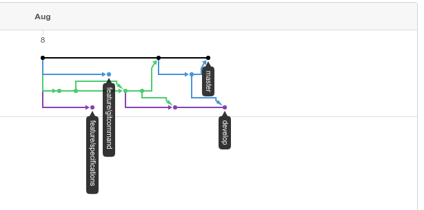

Git-Flow规范和指令
===

## 流程

详细见:
中文：[介绍一个成功的 Git 分支模型](https://www.oschina.net/translate/a-successful-git-branching-model)  
英文：[A successful Git branching model](https://nvie.com/posts/a-successful-git-branching-model/)   

**主分支（长期分支）**

- master 可执行版本记录分支，上面的每个节点都是发布到线上的一个版本，具体的版本号由tag确定
- develop 代码开发分支，所有开发

**辅助分支（短期分支）**

- feature 详细功能分支，每个功能分支应该尽可能的小（最好一天以内），开发完成之后尽快移入仓库中
- release 测试版本发布分支，同时接收该版本的bugfix，直到稳定之后再发布到master，并合并到develop中。
- hotfix 紧急修复线上bug分支，直接从master的版本分出，同时最小版本号加1。修复完成后发布一个最新版本，同时合并到develop中。

## 版本发布分支： master
可执行版本记录分支，上面的每个节点都是发布到线上的一个版本，具体的版本号由tag确定
### 命名规范
`master`是一条长期分支，仅有`master`这个名字。
### commit note
1. 直接表示merge:  
Merge branch 'release/v1.0.1'
2. 表示版本升级
Bump version to v1.1.1

建议使用第二种，因为不想gitlab, github上的节点并不能看到tag，所有只能通过commit note来进行识别，而第二种可以清楚地表达出版本的变化的意思，而不是第一种的git操作。  
**注意**
代码合并的时候，请务必使用 git merge --no-ff &lt;branch-name&gt;  
  
1. 这样会是分支的节点更加清晰，分支中才不会有无关的commit node，特别是对master分支极为重要。
2. 方便对代码的review，可以很清楚地知道这个功能修改了那些内容
3. 方便出错的时候进行回退，只需要回退一个节点接口完成代码的回退
4. 在代码发生冲突的时候，git会为我们创建一个节点，也就是平时看到的“Merge”信息的节点。但如果被合并的代码超前于目标分支，git就会将所有的节点都合并到目标分支中，而不是生成一个新的节点再合并。这对于master分支简直就是灾难，因为release分支或者hotfix分支必然是超前于master分支的。
### Tag
#### 操作

每个tag即表示一个版本，也就是合并一个分支到master都需要打一个tag。
```bash
# git tag v1.2.3 #你可以省略对这个tag的说明
git tag -a v1.2.3 -m "This is comment" [<commit-id>]
git push origin v1.2.3
```

**[参考]**
[廖雪峰的官方网站-创建标签](https://www.liaoxuefeng.com/wiki/0013739516305929606dd18361248578c67b8067c8c017b000/001376951758572072ce1dc172b4178b910d31bc7521ee4000)  
[廖雪峰的官方网站-操作标签](https://www.liaoxuefeng.com/wiki/0013739516305929606dd18361248578c67b8067c8c017b000/001376951885068a0ac7d81c3a64912b35a59b58a1d926b000)  
### 语义化版本
版本格式：主版本号.次版本号.修订号，版本号递增规则如下：

1. 主版本号：当你做了不兼容的 API 修改，
2. 次版本号：当你做了向下兼容的功能性新增，
3. 修订号：当你做了向下兼容的问题修正，包含fixbug。

先行版本号及版本编译信息可以加到“主版本号.次版本号.修订号”的后面，作为延伸。上面写到的tag名则需要准循该规则，v1.2.3中的1.2.3对应主版本号.次版本号.修订号。更加详细的说明请查看：[语义化版本 2.0.0](https://semver.org/lang/zh-CN/)。

**[参考]**
[语义化版本 2.0.0](https://semver.org/lang/zh-CN/)  
### Release
每次push一个tag到github中，即使不是在master分支上，github都会生成一个release版本，并将源码进行压缩打包。但为了更好的记录发布的内容，我们需要到github的release页面中点击[Draft a new release]按钮，或者进入[Tags]的标签页编辑标签信息以完善版本信息。  

#### 日志格式
日志记录的内容是为了让相关的人员能够清楚地知道不同版本之间的变动，从而更好地协作以及为第三方提供服务。  

以下是在github中发布版本时进行填写内容的模板：

Release title: 标签名(版本号)
Describe this release: (选择性地添加如下的不同标题部分，有责填写，无则省略)
```markdown
## Features Added
- add an new API `GET /projects/{projectId}/images` to get images [#<issue-id>](link for the issue) @GuanrongYang
## Features Changed
- save frame annotation in the API `PUT /projects/{projectId}/images/{imageId}/annotation` when saving damage annotation @GuanrongYang
## Features Deprecated
## Features Removed
## Refactored
## Bugs Fixed
## Dependencies Added
## Dependencies Changed
## Dependencies Upgraded
```

- Features Added: 新增的功能
- Features Changed: 修改了已实现的功能的业务逻辑
- Features Deprecated: 不建议使用/在以后的版本中即将删除的功能
- Features Removed: 已经删除的功能
- Refactored: 性能或者结构上的优化，但为改变功能的业务逻辑
- Bugs Fixed: 修复了Bugs
- Dependencies Added: 添加依赖的包
- Dependencies Changed: 修改的依赖的包，比如使用gson替换了json
- Dependencies Upgraded: 依赖包的版本更新

**[注意]**


**[参考]**
[keep a changelog](https://keepachangelog.com/en/1.0.0/)
[release of spring-boot](https://github.com/spring-projects/spring-boot/releases)
### 日志记录文件
日志的每条记录应该写上开发的相关人员的名称，其中的名称请务必是用github中的账户名。同时，如果每个记录有对应的issue, 则请务必以格式`#<issue>`的格式加上issue的编号。  

**CHANGELOG-UNRELEASE.md**  
用于记录本次版本需要发布的内容，其内容格式与“日志格式”格式中的“Describe this release”保持一致。在一个版本发布之后，该文件的内容将会作为Release note中的内容进行发布。请保留所有的标题，以便开发人员在相应的位置填写内容。  
```markdown
[Unreleased]: https://github.com/guanrongYang/gitflow/compare/v1.0.2...develop

## Features Added
- add an new API `GET /projects/{projectId}/images` to get images [#<issue-id>](link for the issue) @GuanrongYang

## Features Changed

## Features Deprecated

## Features Removed

## Refactored

## Bugs Fixed

## Dependencies Added

## Dependencies Changed

## Dependencies Upgraded

```

**CHANGELOG.md**  
如果有必要，可以添加一个CHANGELOG.md的文件，用于记录所有的版本日志，该文件与README.md同级。  
格式如下：  
```markdown
# Changelog
All notable changes to this project will be documented in this file.

## [Unreleased]
### Features Added
- make download image more efficiently [#13870](https://github.com/spring-projects/spring-boot/pull/13870) @GuanrongYang

## [1.0.2] - 2017-06-20
### Features Added
- New visual identity by @tylerfortune8

### Features Changed
- Start using "changelog" over "change log" since it's the common usage
- Rewrite "What makes unicorns cry?" section

### Features Removed
- Section about "changelog" vs "CHANGELOG" @Aboy @Bgirl

## [1.0.1] - 2015-12-03
### Features Added
- RU translation from @aishek
- pt-BR translation from @tallesl
- es-ES translation from @ZeliosAriex


## [1.0.0] - 2015-06-01
### Features Added
- ini the project @GuanrongYang

[Unreleased]: https://github.com/guanrongYang/gitflow/compare/v1.0.2...develop
[1.0.2]: https://github.com/guanrongYang/gitflow/compare/v1.0.1...v1.0.2
[1.0.1]: https://github.com/guanrongYang/gitflow/compare/v1.0.0...v1.0.1
[1.0.2]: https://github.com/guanrongYang/gitflow/compare/v1.0.0...master
```

### master分支权限
为了防止分支被pull或者push错误，这里需要为master设置特殊权限。  
暂时没有找到方法。

## 开发分支: develop
`develop`是一条长期分支，仅有`develop`这个名字。  

由于develop与master以及release都是相互隔离的，所以任意的代码都可以直接推送到develop分支上。但为了能够避免bug的产生，这里依旧希望合并到develop中的代码都是经过测试的（开发人员自己测试或者测试工程师进行测试）且没有问题的。  

其中的代码来自: feature分支, release分支和hotfix分支。

**[注意]**  
合并分支的时候，请务必使用`git merge --no-ff`。理由见上面的`master`中`commit note`的注意。  

## 预发布分支: release
`release`是一条辅助分支，其命名格式为`release/vx.y.z`,其中的x.y.z表示版本号，也就是本次发布的版本。 

该分支会发布到真实模拟的线上环境进行测试，如果没有问题就会发布到master中，否则会在该分支下进行fixbug，直到可以发布未知。如需要利用基于release分支添加新的分支来修复bug，请以`fixbug/<title>`的方式命名分支。  

这里附加一点，由于版本发布中可能会发现一些bug是会影响到之后的开发的，这时候，应该允许提前将release分支合并回到develop中，但release的保持正常的测试和发布，并且在合并到master分支之后必需合并回develop。

## 线上紧急修复分支: hotfix
`hotfix`是一条辅助分支，用于修复线上的紧急bug，其命名格式为/vx.y.z (其中x.y.z表示版本号)。  

由于hotfix分支是对master上已经发布的版本进行修复的分支，所有其对应的版本号延续其出发的master的节点的版本号，但在修复完成之后会重新发布一个版本到master中，并将z（修订号）增加1。  

**[注意]**
1. hotfix分支发布到master之后，请务必将hotfix分支合并到developop中。
2. 如果hotfix分支在发布一个版本到master时，存在一个release分支，则需要将该hotfix的分支合并到release分支，而不是develop分支。后面再通过release分支将该修复合并回到develop中。

## 功能开发分支: feature
`feature`是一条辅助分支，来源于develop，用于开发新的功能或者修复develop上的bugs，feature/#issue-featurename（#issue为功能对应的issue的号码，没有的时候请直接忽略）。  

除非是一次commit即可解决的问题，否则请务必使用独立的分支进行开发。独立的功能分支可以方便开发中任务的切换，保持develop分支的清晰以及出错的回退等等。  

## 指令
### Git指令
```bash
# 创建一个仓库
mkdir gitflow
cd gitflow
git init

touch README.md
# ... 编辑 README.md
git add README.md
git commit -m "add README.md"

# 创建develop长期分支
git checkout -b develop
# develop分支必须先与feature分支推到远程仓库中
git push origin develop
# 获取远程仓库的develop分支到本地develop分支
# git fetch origin develop:develop

# 在develop的基础上创建功能分支
git checkout -b feature/baseinfo develop
# ... 开发功能 feature/baseinfo
git push origin feature/baseinfo
# 合并开发好且通过测试的feature/baseinfo到develop
git checkout develop
git merge --no-ff feature/baseinfo

# 移除开发完成的功能分支feature/baseinfo
git branch -d feature/baseinfo
# 删除远程仓库的功能分支
git push origin :feature/baseinfo

# ... 继续开发合并其他分支

# 预发布
git checkout -b release/v0.1.0 develop
git commit -a -m "initial version  v0.1.0"
# ... 在release/v0.1.0上修改bugs

# 发布线上版本
git checkout master
git merge --no-ff release/v0.1.0
# commit note: initial version v0.1.1
git tag v0.1.0
git push origin master
git push origin v0.1.0

# 将release中修改过的代码合并到develop中
git checkout develop
git merge --no-ff release/v0.1.0

# 删除不需要的release分支
# 删除本地release分支
git branch -d release/v0.1.0
# 删除远程release分支
git push origin :release/v0.1.0

# 在线上发现一个Bug，需要紧急修复，一般来说，v0是还没有上线的版本
git checkout -b hotfix/v0.1.0 master
# ... 修复bugs
# 重新发布一个版本，修订号加上1
git checkout master
git merge --no-ff hotfix/v0.1.0
# commit note: bump version to v0.1.1
git tag v0.1.1
git push origin master
git push origin v0.1.1

# 将hotfix分支合并到develop中，如果此时有未发布的release分支，则合并到release分支中
git checkout develop
git merge --no-ff hotfix/v0.1.0
git push origin develop

# 删除hotfix分支
git branch -d hotfix/v0.1.0
git push origin :hotfix/v0.1.0
```

经过以上的流程，我们可以得到如下的历史记录线图：  
  

以上的操作中，我们发布了两个版本0.1.0和0.1.1，这时可以在release中修改版本信息。

### Git-flow指令

## 注意事项
### 限制只能在master分支创建hotfix分支和develop分支
### 代码推送的方向
可以合并到master的分支: hotfix, release  
可以合并到develop的分支: feature，release，hotfix  
可以合并到release的分支: hotfix，hotfix上自身的分支，如`release/vx.y.z/<subbranchname>`  
可以合并到feature的分支: 该feature自身的分支，如`feature/<featurename>/<subbranchname>`
可以合并到hotfix的分支: 该hotfix自身的分支，如`hotfix/vx.y.z/<subbranchname>`  
禁止上出develop分支  
### 不要pull/push错误分支
利用git hooks进行设置。https://www.jianshu.com/p/527e34f53b51

## 其他
### 几个教程
[分支的练习]()
